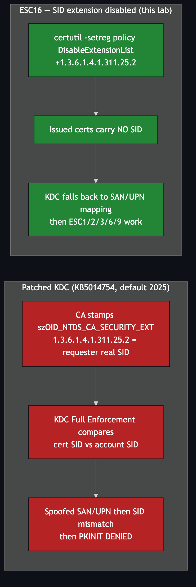

# ESC16 — SID Security Extension Disabled on the CA

**Impact:** re-enables ESC1/2/3/6/9 on an otherwise-patched DC
**Lab status:** ✅ enabled by design — this is the prerequisite that makes the range work

---

## Concept

Since **KB5014754** (May 2022, enforced by default Feb 2025), Active Directory
certificate authentication hardened around a **SID security extension**:

- The CA embeds the requester's **real SID** in every certificate via
  `szOID_NTDS_CA_SECURITY_EXT` (**OID `1.3.6.1.4.1.311.25.2`**).
- The KDC, in **Full Enforcement** (`StrongCertificateBindingEnforcement = 2`,
  the modern default), compares that SID against the account being authenticated.
- A certificate with a **spoofed SAN/UPN** now fails, because the embedded SID
  still points at the original requester. **This single control breaks ESC1, ESC2,
  ESC3, ESC6 and ESC9.**

**ESC16** is the misconfiguration where an administrator tells the CA to **stop
adding** that extension — for *all* issued certificates — by putting the OID on
the CA's `DisableExtensionList`. With no SID in the certificate, the KDC falls
back to the old, spoofable SAN→UPN binding, and every classic ESC works again.



---

## Configuration in the lab

Applied on the CA during deployment:

```powershell
certutil -setreg policy\DisableExtensionList +1.3.6.1.4.1.311.25.2
Restart-Service certsvc
```

Certipy reports it as ESC16 in `find`, and every issued certificate now shows:

```
[*] Certificate has no object SID
```

That warning is **expected in this lab** — it is the whole point. It is also why
every `req` in these docs passes an explicit **`-sid`**: you assert the target SID
for the tooling since the certificate itself no longer carries one.

---

## Verifying the state

On the CA:

```powershell
certutil -getreg policy\DisableExtensionList
# should list 1.3.6.1.4.1.311.25.2
```

---

## Re-hardening (make the attacks fail as in production)

To see ESC1/2/3/6/9 correctly **denied** the way a patched DC would:

```powershell
certutil -setreg policy\DisableExtensionList -1.3.6.1.4.1.311.25.2
Restart-Service certsvc
```

And ensure Full Enforcement on the KDC:

```powershell
reg add HKLM\SYSTEM\CurrentControlSet\Services\Kdc /v StrongCertificateBindingEnforcement /t REG_DWORD /d 2 /f
```

Re-run any ESC1 request afterwards and PKINIT should fail with a SID mismatch
(`KDC_ERR_CLIENT_NAME_MISMATCH`) — proof the hardening works.

---

## Teaching value

ESC16 is the bridge between the "classic" AD CS attacks and today's patched
reality. It shows students **why** ESC1-style spoofing largely died — and that a
single careless CA registry setting resurrects the entire class of attacks.

---

## Detection & defence

- **Never** place `1.3.6.1.4.1.311.25.2` on `DisableExtensionList`. Audit the value
  on every CA.
- Keep `StrongCertificateBindingEnforcement = 2`.
- Monitor CA policy registry changes (event 4890).
