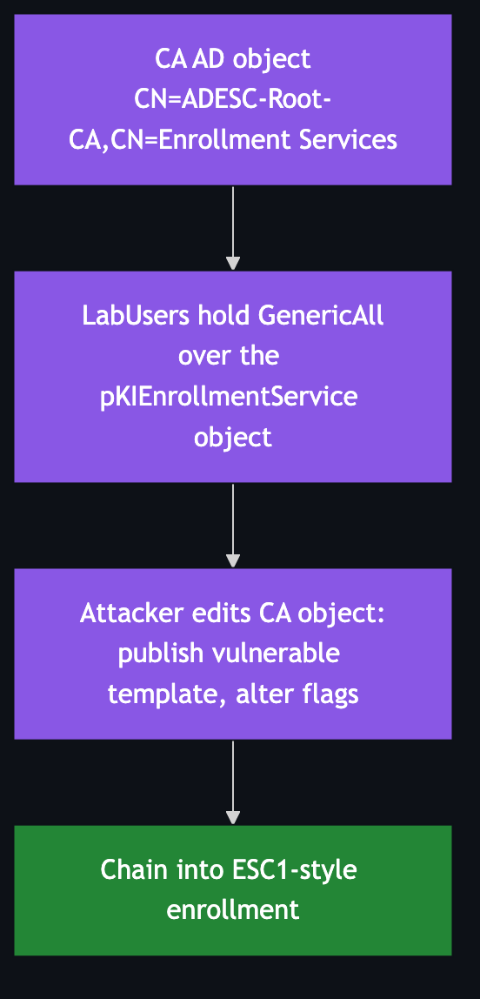

# ESC5 — Vulnerable PKI Object Access Control

**Impact:** control of a PKI-related AD object → CA compromise → **Domain Admin**
**Lab status:** ⚙️ misconfiguration present; exploit left as exercise

---

## Concept

ESC4 is about write access to a *template*. ESC5 widens the lens to **any AD object
the CA depends on**:

- the **CA's own `pKIEnrollmentService`** object (`CN=<CA>,CN=Enrollment
  Services,CN=Public Key Services,…`),
- the CA computer object / its `NTAuthCertificates` store,
- the `CN=Public Key Services` container and its children (OID container, CDP,
  etc.).

If a low-priv principal holds `GenericAll`/`WriteDacl` over one of these, they can
reconfigure the PKI — publish a rogue template to the CA, alter which templates it
offers, or manipulate trust objects — and pivot into an ESC1-style issuance.



---

## Configuration in the lab

| Attribute | Value |
|-----------|-------|
| Object | CA enrollment object `CN=ADESC-Root-CA,CN=Enrollment Services,CN=Public Key Services,CN=Services,CN=Configuration,DC=adescrtl,DC=lab` |
| Dangerous ACE | `ADESCRTL.LAB\LabUsers` → **GenericAll** |

Confirm:

```bash
certipy find -u lowpriv@adescrtl.lab -p 'Lab12345!' -dc-ip 10.0.0.5 -vulnerable -stdout
```

---

## Exploitation outline

Because `LabUsers` control the CA object, the attacker can:

1. **Publish a vulnerable template** to the CA by adding its name to the object's
   `certificateTemplates` attribute (making an unpublished ESC1-style template
   live), or
2. **Grant themselves enrollment** on an existing sensitive template by editing
   its ACL (overlaps with ESC4), then enroll as in [ESC1](ESC1.md).

Edit the object's DACL / attributes with any AD tooling honouring the granted
right (PowerShell `Set-Acl`/`Set-ADObject`, `ldapmodify`, or Certipy where
supported), then follow the ESC1 request+auth flow.

---

## Detection & defence

- Audit ACLs across the **entire `CN=Public Key Services`** subtree, not just
  templates. This container is tier-0.
- Watch for writes to `certificateTemplates` on the CA object (template
  publication) by non-admins.
- Remove inherited or accidental `GenericAll` grants to broad groups.
